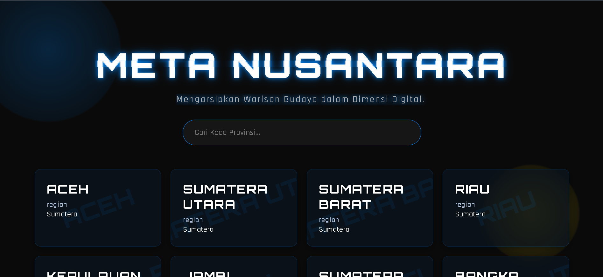
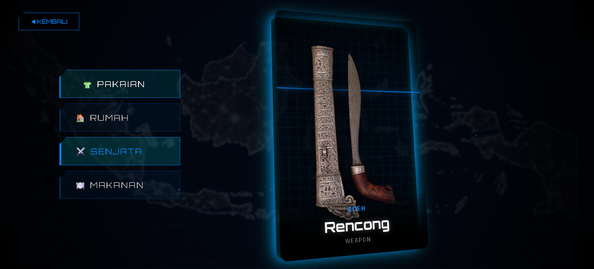

**Mengarsipkan Warisan Budaya dalam Dimensi Digital.**

**META NUSANTARA** adalah sebuah website bertema futuristik/cyberpunk yang bertujuan untuk mendigitalisasi informasi kebudayaan Indonesia (Pakaian, Rumah Adat, Senjata, Makanan). Proyek ini dibuat menggunakan **Pure HTML, CSS, dan JavaScript** (tanpa framework) untuk mendemonstrasikan manipulasi DOM dan *Advanced CSS Animations*.

---

## 📸 Tampilan (Screenshots)

| Halaman Depan (Landing) | Halaman Detail (Hologram) |
| :---: | :---: |
|  |  |
| *Efek Glitch & Grid Navigasi* | *Efek 3D Tilt & Adaptive UI* |

*(Catatan: Ganti `path/to/screenshot` dengan lokasi gambar screenshot proyekmu)*

---

## ✨ Fitur Unggulan

### 1. 🎨 Tampilan Futuristik (Cyberpunk Theme)
* **Cinematic Intro:** Animasi *reveal* dengan efek *blur-to-focus* pada judul utama.
* **Glitch Effect:** Efek kerusakan digital pada teks yang dianimasikan secara manual menggunakan CSS Keyframes.
* **Immersive Background:** Menggunakan layer animasi berlapis:
    * *Moving Grid Floor* (Lantai 3D bergerak).
    * *Breathing Map* (Peta Indonesia berdenyut).
    * *Particle Stars* (Partikel bintang bergerak).

### 2. 🖼️ Kartu Hologram Interaktif (2D Tilt)
* Menggunakan JavaScript untuk mendeteksi posisi mouse.
* Kartu akan miring (*tilt*) mengikuti arah kursor, menciptakan ilusi kedalaman 3D yang realistis.
* Efek cahaya neon (*glow*) yang dinamis.

### 3. 🧠 Adaptive UI Logic (Smart Content)
Sistem cerdas yang menyesuaikan tampilan gambar berdasarkan kategori:
* **Mode Full:** Untuk Pakaian/Rumah/Makanan, gambar ditampilkan memenuhi kartu (*immersive wallpaper*).
* **Mode Weapon:** Khusus Senjata, gambar ditampilkan melayang (*floating*) di tengah dengan efek levitasi 2D agar detail benda terlihat utuh.

### 4. ⚡ Performa & Struktur
* **Single Page Feel:** Transisi antar halaman yang halus.
* **Modular Code:** Pemisahan struktur folder (`halaman-depan` dan `halaman-detail`) agar kode rapi dan mudah dikelola (Clean Code).
* **Real-time Search:** Fitur pencarian provinsi yang cepat tanpa *reload* halaman.

---

## 📂 Struktur Folder

```text
JATIMFEST/
├── index.html                 # File redirect utama
├── README.md                  # Dokumentasi proyek
│
├── halaman-depan/             # LANDING PAGE
│   ├── index.html
│   └── assets/
│       ├── style.css          # Style khusus landing page
│       └── script.js          # Logika search & render grid
│
├── halaman-detail/            # HOLOGRAM PAGE
    ├── index.html
    └── assets/
        ├── style.css          # Style khusus 2D card & animasi
        ├── script.js          # Logika render data & kategori
        └── images/            # Aset gambar (Map, dll)
